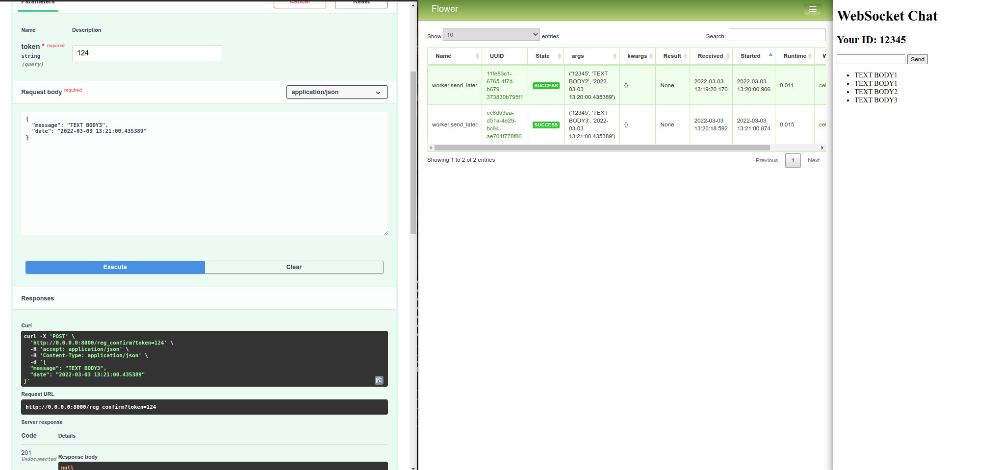

# Notifier

Service for sending notifications to user. If user online - send realtime messages,
else set them to db and send mess, when user online again.


## What I used

- Python
- Fastapi
- Pydantic
- Uvicorn
- Redis(aioredis)
- Celery
- Flower
- Docker

## Local deploy

+ Set secrets in .env like in env.example with your data:
+ [Install docker ](https://docs.docker.com/get-docker/)
+ If you don't need any files or dirs in container, you can set them in .dockerignore
+ Run:
    ```sh
    $ docker-compose up
    ```
+ Docs you can find at http://localhost:8000/docs
+ Flower monitor at http://localhost:5555


